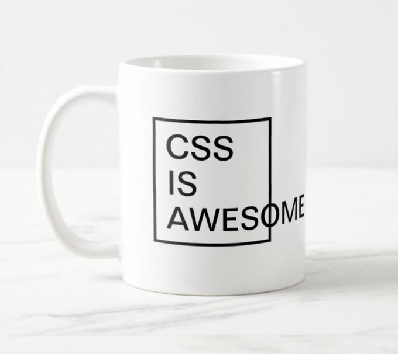

# Styles

## CSS is Awesome

css-tricks.com posted an article ["CSS is Awesome"](https://css-tricks.com/css-is-awesome/) \(probably after Tantek Çelik's write up in the [CSS Basic User Interface Module Level 4 first public working draft](https://www.w3.org/TR/2015/WD-css-ui-4-20150922/)\). For a little quiz to see if you understand the overflow problems of CSS, look [here](https://css-tricks.com/which-css-is-awesome-makes-the-most-sense-if-you-dont-know-css-well/). The nerdy joke is presented on T-shirts, coffee mugs, and websites:

While [some people](https://uxdesign.cc/why-do-most-developers-hate-css-63c92bce36ed) might not have a problem with CSS, it is obvious many people do. The css-tricks post lists the problems and their solutions \(or workarounds\), but there are other simple solutions \(some perhaps better described as workarounds\) to the big problems of web styles: 

The essence of many CSS problems and the web's evolution past them are described in another css-tricks.com post, ["A Complete Guide to Grid"](https://css-tricks.com/snippets/css/complete-guide-grid/): "... CSS has always been used to lay out our web pages, but it’s never done a very good job of it. First, we used tables, then floats, positioning and inline-block, but all of these methods were essentially hacks and left out a lot of important functionality \(vertical centering, for instance\). **Flexbox** helped out, but it’s intended for simpler one-dimensional layouts, not complex two-dimensional ones \(Flexbox and Grid actually work very well together\). **Grid** is the very first CSS module created specifically to solve the layout problems we’ve all been hacking our way around for as long as we’ve been making websites." \[Emphasis mine\]

## Problem with CSS's global scope

Vaadin.com's tutorial ["CSS Encapsulation with Shadow DOM"](https://vaadin.com/learn/tutorials/css-encapsulation-with-shadow-dom) describes the problem of CSS's global scope and "the browser's very own solution to CSS encapsulation": "The Shadow DOM allows the browser to render DOM elements without putting them in the main DOM tree, which enables local scoping for HTML and CSS." Interestingly, as of [April, 2021](https://www.youtube.com/watch?v=h3MONldIoNM), Chrome 90 browser will enable shadow DOMs to be created declaratively.

The basic idea of the Vaadin tutorial is to use a shadow DOM, but it is not necessary to do that directly. Web Components can create shadow DOMs automatically, and some of them \(like at least some of the Vaadin components\) are easy to target with JavaScript events, thus simplifying their direct manipulation via the mouse or touch. \(See ["Front-End Components"](https://tomelam.gitbook.io/mashweb/part-4-web-page-structure/front-end-components) to learn how this is important.\)

